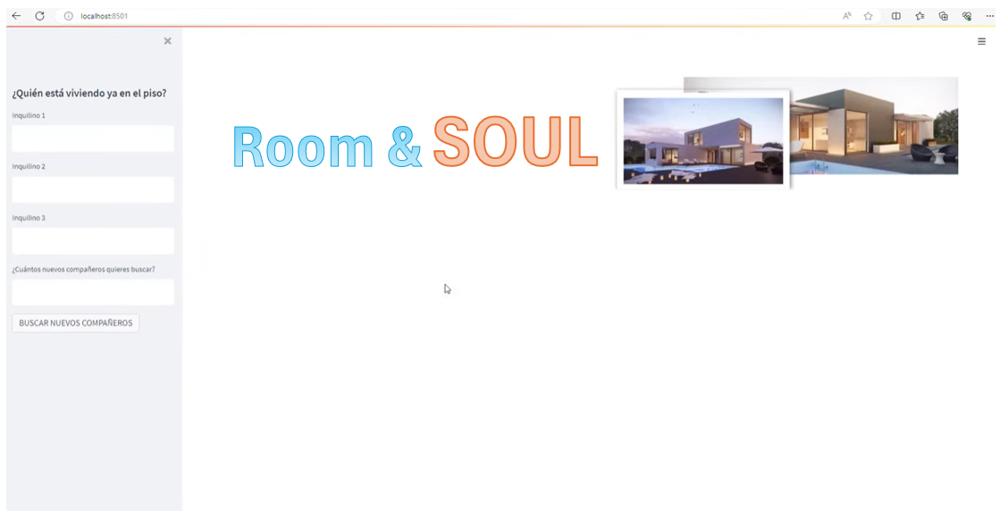
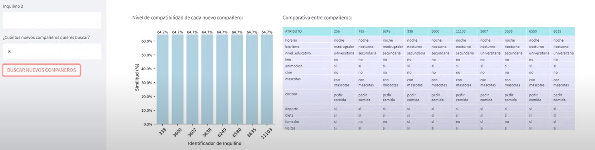
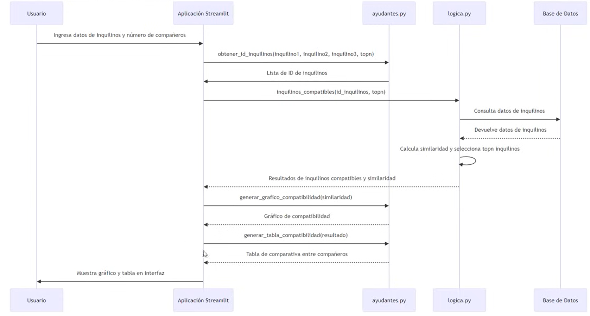
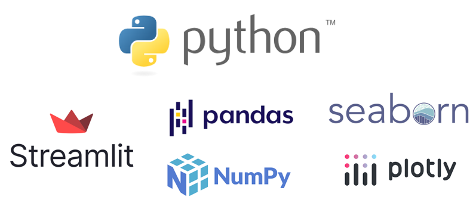

# Room & Soul -- Tu compañero perfecto!

## Un gran proyecto Data Science
  

Bienvenido/a a esta "pequeña" aplicación/proyecto que te facilitará mucho las cosas a la hora de encontrar tu compañero de piso ideal!
  

### 1. El problema

Ahora que el mercado inmobiliario de las grandes ciudades demanda cada vez más el modelo de piso compartido, no querrás llegar a tu futuro piso y no conectar al 100% con el/los que serán tus compañeros de vida durante las próximos meses o quizás años! Cada vez es más importante no sólo que el piso buscado se ajuste a tus necesidades y gustos sino también se trata de recomendar los mejores compañeros de piso en cuanto a afinidad de las personas que en el viven.
  

### 2. Intuición de la solución

Ya tenemos descrito "el problema" de tener que encontrar compañeros de piso afines a uno/a que ya se encuentra viviendo en una cierta propiedad. En el caso de este proyecto se tiene una base de datos (en este caso un fichero plano CSV) con más de 12000 registros que corresponden a candidatos a compañeros de piso con las respuestas que han dado a un pequeño formulario de compatibilidad. Algunas de las preguntas presentes en dicho formulario han sido:

* ¿Cuál es tu nivel educativo? -> (Educación Secundaria, Formación Profesional, Formación Universitaria)
* ¿Te gusta más cocinar o pedir comida a domicilio? -> (Cocinar, Pedir Comida)
* ¿Eres fumador? -> (Sí, No)

Con esta serie de preguntas se persigue conocer varios aspectos clave dentro de la convivencia de personas que no son de una misma familia dentro de pisos compartidos.

#### 2.1 El Algormitmo

Este conjunto de respuestas de cada uno de nuestros potenciales compañeros de piso puede mapearse como un vector de alta dimensionalidad. De esta manera podemos emplear el concepto de [similitud entre vectores](https://keepcoding.io/blog/similitud-entre-vectores-o-cosine-similarity/) como medida para calcular la similitud entre dos candidatos a compartir ese futuro piso.

Fig. 1 - Representación gráfica de la similitud entre vectores
  

### 3. Implementación Técnica

Conociendo que la base teórica de la solución será la implementación de un algoritmo de cálculo de similitud-coseno entre vectores (siendo estos los valores, debidamente pre-procesados y tratados, de respuesta a la encuesta de compatibilidad) a continuación exponemos la solución técnica empleada.

#### 3.1 Aplicación Streamlit

Por encima de la arquitectura de solución encontramos una aplicación realizada con Streamlit que posibilita una interfaz de usuario cómoda y versátil para poder proporcionar información sobre al menos un compañero de piso ya presente en la propiedad y a partir de ahí pedir al sistema que nos muestre el/los candidatos más similares al/a los ya prentes:

Fig. 2 - Interfaz de Usuario usando Streamlit renderizada en servidor local.
  

Tras la introducción de datos a la interfaz, clicando el botón **BUSCAR NUEVOS COMPAÑEROS** se efectuan los calculos de similiridad y ordenamiento de los resultados para ser devueltos estos por pantalla tal y como muestra la **Figura 3**

Fig. 3 - Visualizaciones de candidatos recomendados a compañeros con ID 256 y 789 ya residiendo en la propiedad.
  

#### 3.2 Flujo Funcional

En la Figura 4 se puede observar el flujo funcional entre piezas de código de la aplicación. En total tenemos 5 piezas fundamentales:
  

1. Usuario de la aplicación
2. [app.py](/app.py) --> Aplicación Streamlit
3. [ayudantes.py](/ayudantes.py) --> Código con funciones de ayuda (helpers) que renderizan los gráficos y realizan cálculos sobre la matriz de similaridad
4. [logica.py](/logica.py) --> Código que consulta la BBDD (en este caso lectura de un CSV) y realiza los cálculos de similitud de vectores así como el escalado y preprocesado de datos previo al cálculo de la distancia coseno.
5. [Base de Datos (Fichero CSV)](/dataset_inquilinos.csv) --> Continente de las respuestas de los +12000 usuarios candidatos a compartir piso.
  

#### 3.3 Librerías Empleadas (Stack)

El Stack empleado en el desarrollo de esta aplicación puede verse en la figura 5:

### 4. Créditos

Realizado por Eduardo Gil González-Madroño
Dataset incorporado desde [DS4B](https://datascience4business.com/)

&copy; Marzo 2024.
